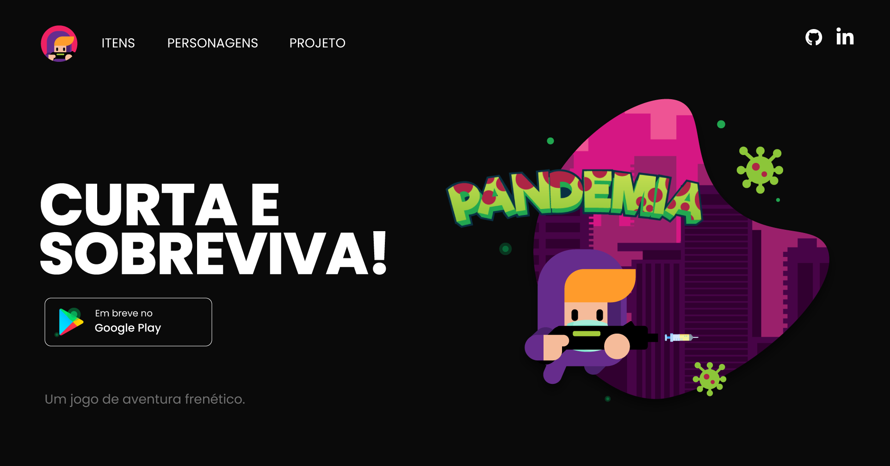

<p align="center">
  
</p>

<p align="center">
     
</p>

<h1 align="center">
    
</h1>

<br>

## 🧪 Tecnologias

Esse projeto foi desenvolvido com as seguintes tecnologias:

- [React](https://reactjs.org)
- [Firebase](https://firebase.google.com/)
- [TypeScript](https://www.typescriptlang.org/)

## 🚀 Como executar

Clone o projeto e acesse a pasta do mesmo.

```bash
$ git clone https://github.com/alexsantosdev/pandemia-web.git
$ cd pandemia-web
```

Para iniciá-lo, siga os passos abaixo:
```bash
# Instalar as dependências
$ npm install

# Iniciar o projeto
$ npm run dev
```
O app estará disponível no seu browser pelo endereço http://127.0.0.1:5173/.

Lembrando que será necessário criar uma conta no [Firebase](https://firebase.google.com/) e um projeto para disponibilizar um Realtime Database.

## 💻 Projeto

Pandemia é um jogo plataforma 2D baseado nos antigos jogos frenéticos como Metal Slug, sua dinâmica se inspira no caos ocasionado pelo vírus e a busca pela cura. 

Este é um projeto desenvolvido durante o Trabalho de Conclusão de Curso (TCC).


## 🔖 Layout

Você pode visualizar o layout do projeto através do link abaixo:

- [Layout Web](https://playpandemiagame.web.app) 

## 📝 License

Esse projeto está sob a licença MIT. Veja o arquivo [LICENSE](LICENSE.md) para mais detalhes.

---

Feito com 💜 por Alex Santos 👋🏻 [Veja meu LinkedIn](https://linkedin.com/in/alexsantosdev)